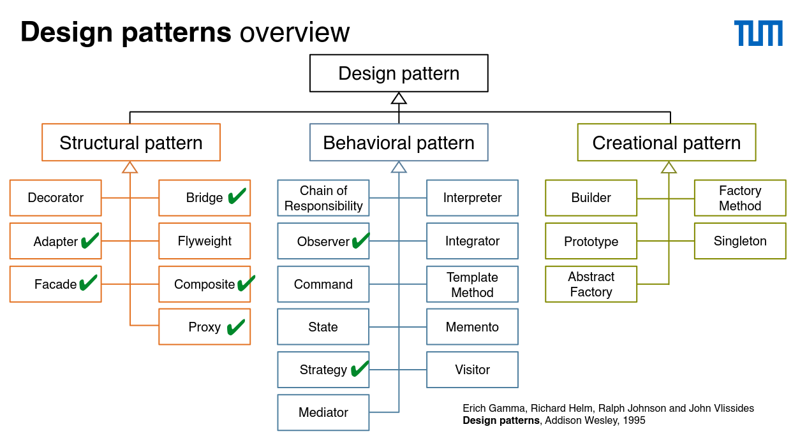
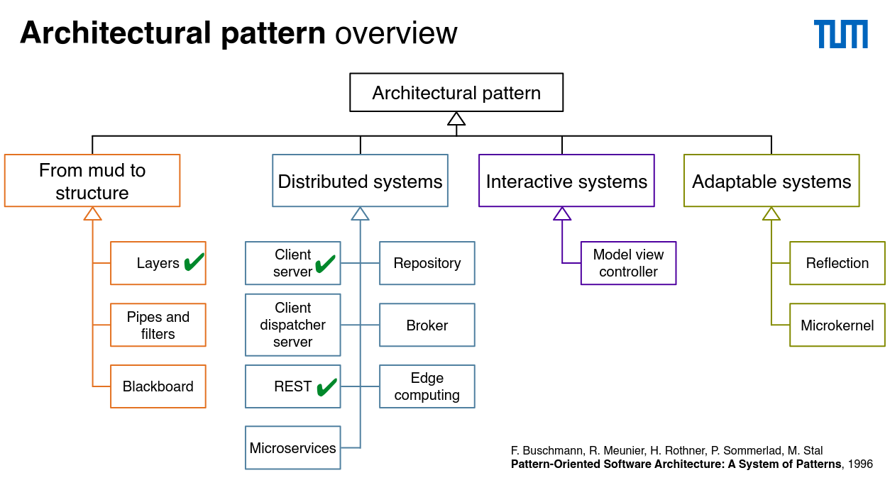
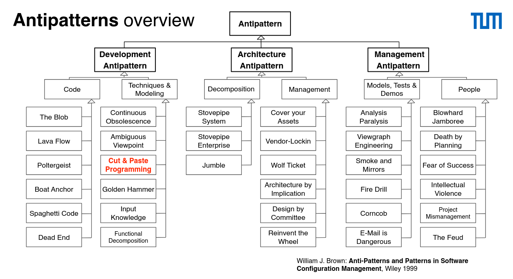

# Patterns are building blocks of software engineering knowledge

- Technical knowledge
- Managerial knowledge

## Software development: more than just writing code

- Problem solving
- Dealing with complexity
- Knowledge management
- Rationale management

## How to describe SE knowledge

- Set of Algorithms
- Catalog of patterns descibing generix solutions for recurring problems

## Antipattern vs. Pattern

- Def. Pattern: a three-part rule, which expresses a relation between a certain context, a problem, and a solution
- Pattern language: a collection of patterns and the rules to combine them into architectural style
- Pattern catalog: collection of related patterns

> Design patterns address nonfunctional requirements

