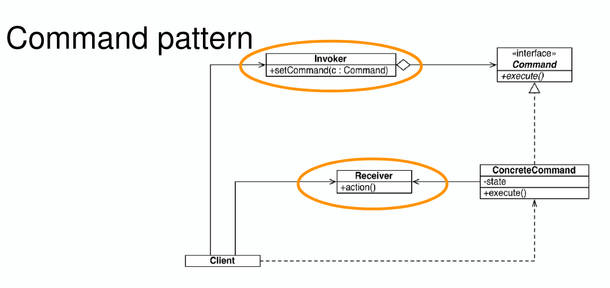
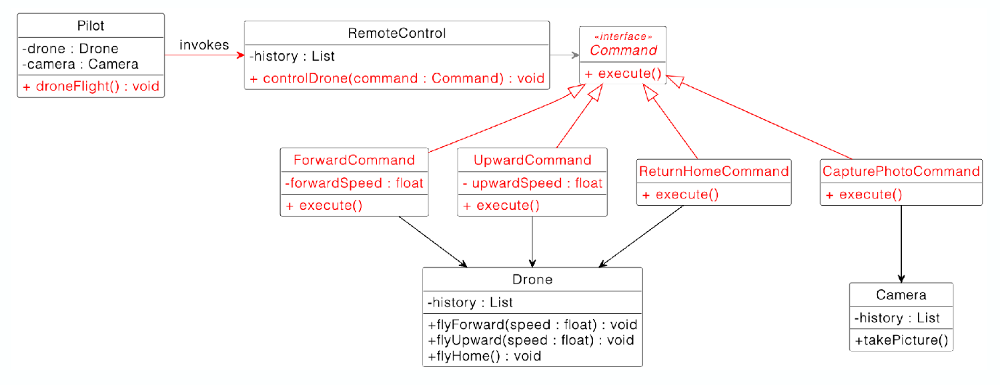

# Command Pattern

## User Interface and User Model

- Natural mapping
  - A mapping between “User interface controls” (boundary objects) of a system and objects in the real world
  - Simple
  - Physical Layout

## Command pattern

- The Client creates instances of ConcreteCommand
- ConcreteCommand.execute() calls the Receiver.action() method which does the
  work
- Benefits:
  - Complexity reduction
  - Dealing with changes
    
    
    Here, `Drone` is the `Receiver`, `RemoteControl` is the `Invoker`.
