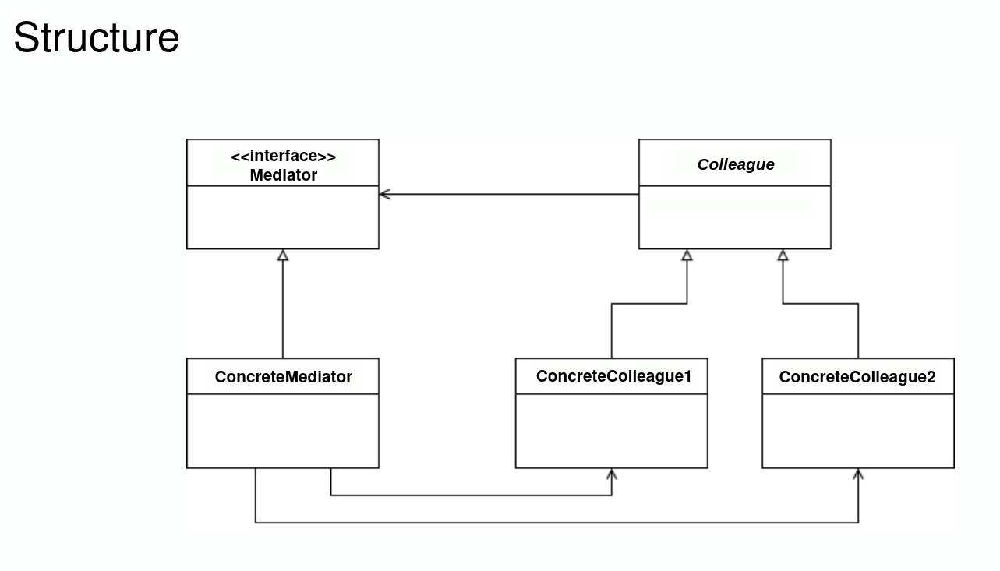
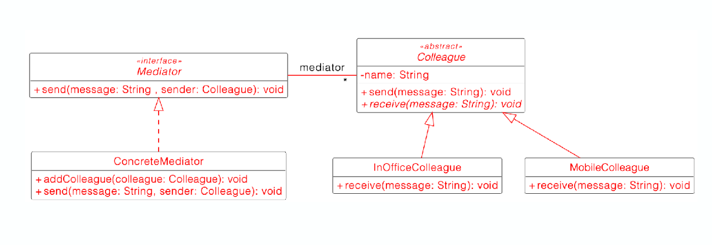

# Mediator Pattern

- Single responsibility principle
- Reduce coupling between classes that communicate with each other
- Define an mediator object that encapsulates how a set of objects interact, restrict direct communications between the objects and force them to collaborate only via this objec
- Reconsider specific usecase or possible faulty design before applying
- Be careful not to create a controller or god object
- Mediator can use observer for dynamically registering colleagues and communicating with them

In this example, the Mediator allows the `Colleague` objects to send message to every other colleagues without knowing their existence.
