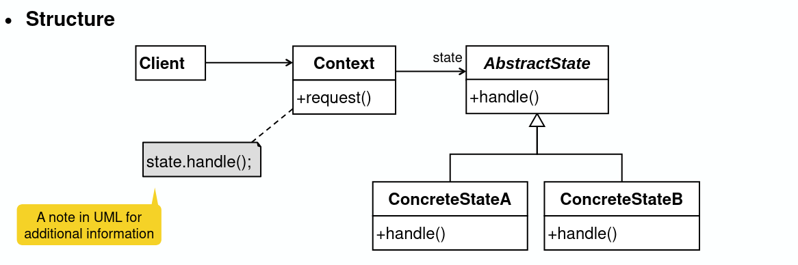

# State Pattern

## State

- Def: An abstraction of the attributes of a class, has a certain duration

## State pattern

- Useful for objects which change their state at runtime
- Polymorphism: selection depends on the state of the object
- Comparison:
  - Bridge pattern: selection done at system init time
  - Strategy pattern: selection depends on an external policy (runtime)
- Benefits:
  - Localizes state-specific behavior
  - Extensibility and flexibility
  - Avoids clustered if-else or switch-case statements
  - Makes state transitions explicit
- Design questions:

  - Context class or concrete states: where to define state transition?
  - When to create and destroy states?

    
    
