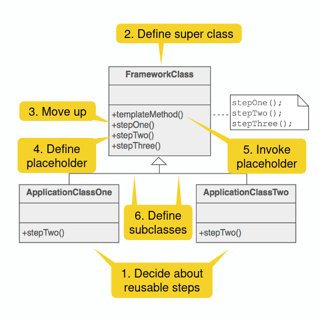

# Template Method Pattern

## Strategy vs. Template method pattern

- Both are similar except the **granularity**
- Strategy uses **delegation** to vary the **entire algorithm**
- Template method uses **inheritance** to vary **parts of an algorithm**
- Strategy modifies the **logic of individual objects**
- Template method modifies the **logic of an entire class**
  
