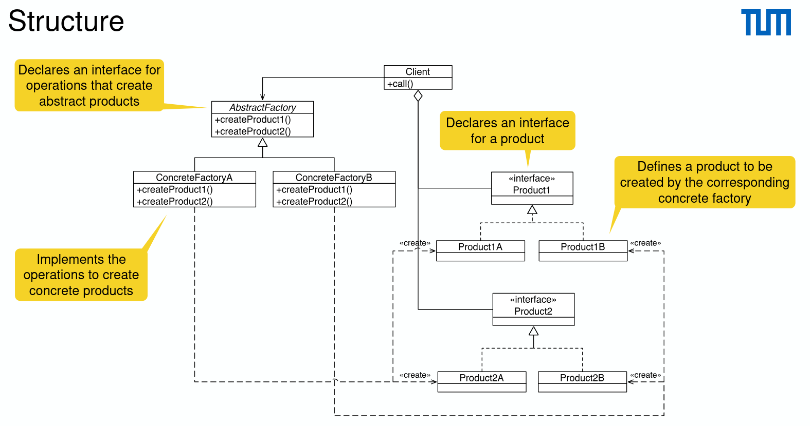

# Abstract Factory Pattern

- From the factory method to the abstract factory pattern: generalize
- Benefits
  - Compatibility of products produced by the factory
  - Low coupling between concrete products and client code
  - Single responsibility principle
  - Open/closed principle: new variants of products
- Drawbacks
  - Complex code
- An alternative to the facade pattern when only to hide the way the subsystem objects are created from the client code
- Can use along with the bridge pattern
  
  Different Factories create different products.
