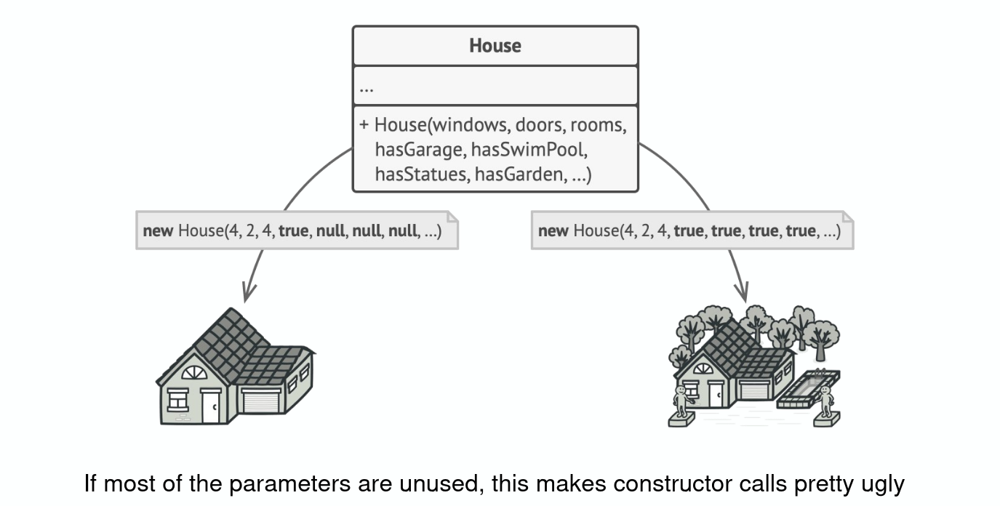
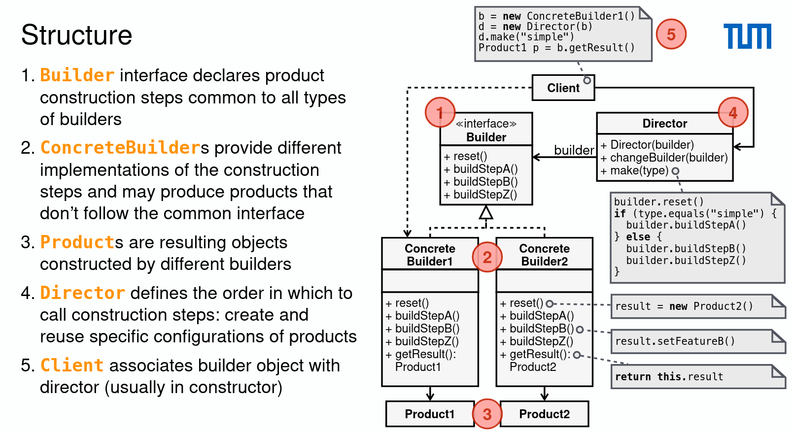
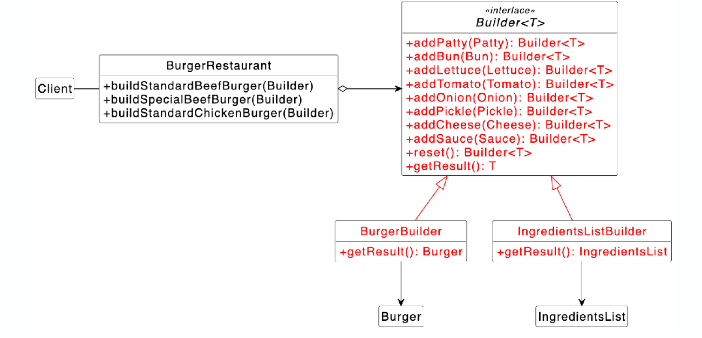

# Builder Pattern

- Problem:
  
- Structure:
  - The client asks the director to construct
  - The client asks the builder to return the result
    
- Focuses on constructing a complex object step by step
- Often builds a composite
- Design starts using Factory Method and evolves towards Builder/Abstract Factory

