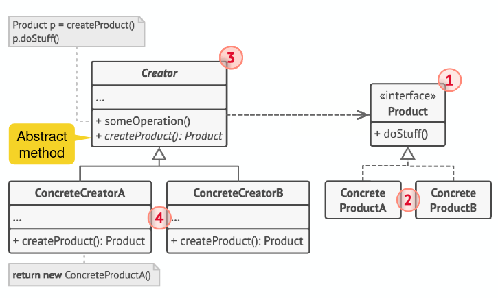

# Factory Method Pattern

- Instantiate new objects without depending on concrete implementations
- Define an interface for creating an object, but let subclasses decide which class to instantiate
- Defining a virtual constructor
- Exensibility (new products)
- Consider designing an internal object pool that will allow objects to be reused instead of created from scratch (caching)
- Consider making all constructors private or protected
- Usually called within template methods
- Sometimes evolve towards Abstract Factory or Builder when more flexibility is needed
  
  
