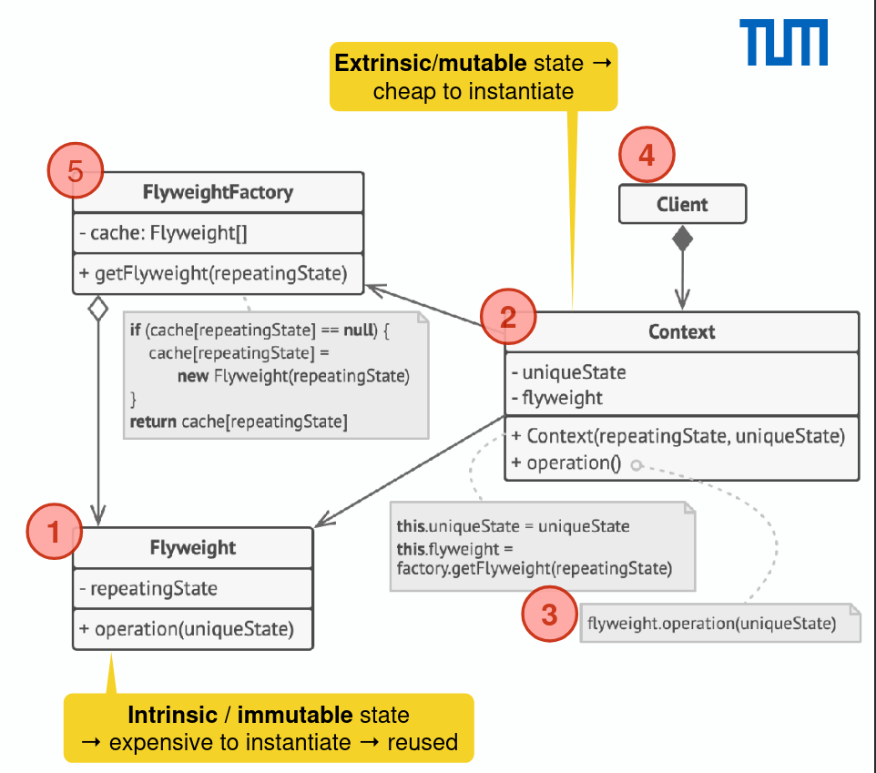

# Flyweight Pattern

- Share objects to allow their use at fine granularity without prohibitive cost
- Each flyweight object is divided into two pieces
  - Extrinsic/mutable (shareable): the state dependent part: stored or computed by client objects, and passed to the flyweight when its operations are invoked
  - Intrinsic/immutable (heavy part, non-shareable): the state independent part: stored (shared) in the flyweight object
- Client uses the factory instead of the new operator to request objects
- Often combined with composite to implement shared leaf nodes
- Explains when and how state objects can be shared
  
