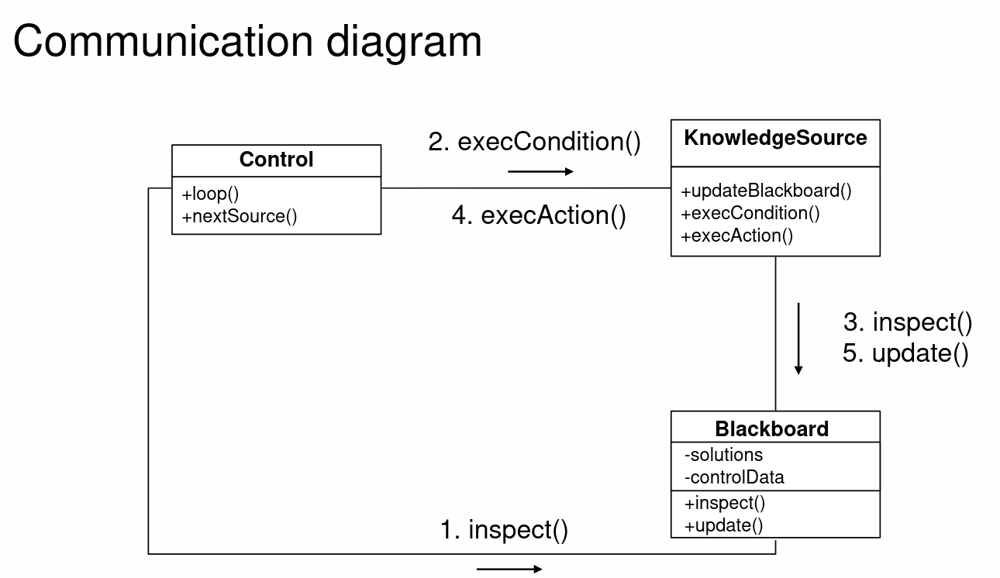
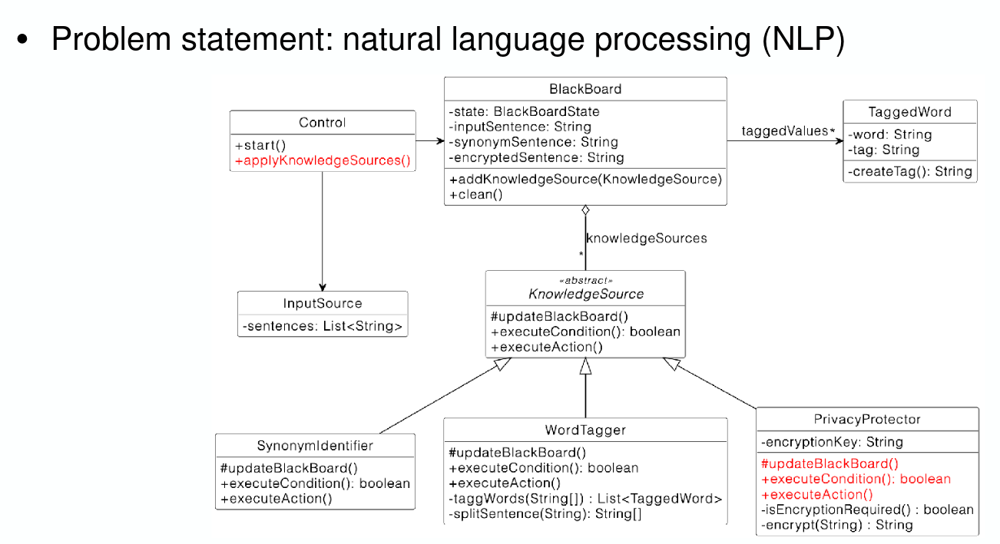

# Blackboard

- Blackboard: repo for problem, partial solutions, and new infos (hypotheses, rejected ones by KS are removed)
- Knowledge sources: reads info on blackboard and create new info on it (a higer level solution)
  - Condition part
  - Action part
- Control: govern the flow (knowledge sources get notified of new info)
  
  
  We can use a BlackboardState to indicate which state the (content on) blackboard is in. We can delegate the execution of KS in Control.
- Advantages
  - Problem solving support
  - Changeability and maintainability
  - Fault tolerance and robustness
- Limitations
  - Difficulty of testing
  - No solution guaranteed
  - Difficulty to establish a good control strategy
  - High development effort
