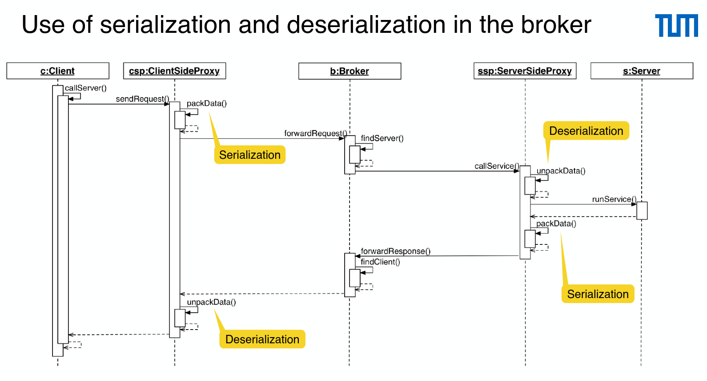
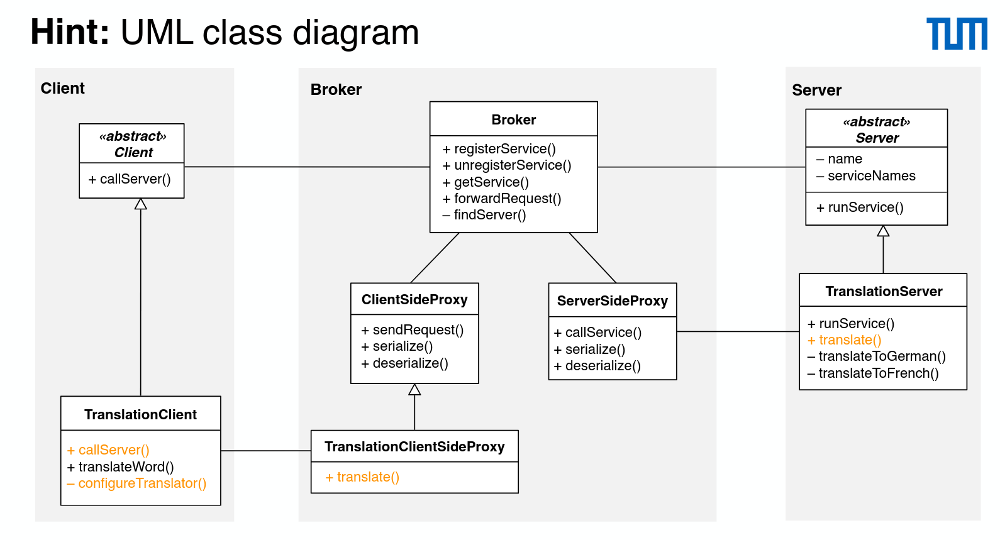

# Broker

Typically, `Client` and `Server` or their proxies both have a `Broker` field, used to register services and forward requests.

- Client side proxy: layer between client and broker
  - Remote objects (in the server) appear as local ones
  - Translates the object model specified by the server into an object model in the client
  - Hides interprocess communication details between client and broker
- Server side proxy: layer between broker and server
  - Receives requests from the broker
  - Hides interprocess communication details between broker and server
  - Calls the services in the server
- Serilization: marschaling
- Deserialization: unmarshaling
- Synchronous
  - The client issues the method call and waits (blocks) until the result is returned
- Asynchronous
  - The client issues the method call, and continues (a non-blocking method call)
  - It gets notified by broker when the result is ready
  - This is usually implemented using callbacks
