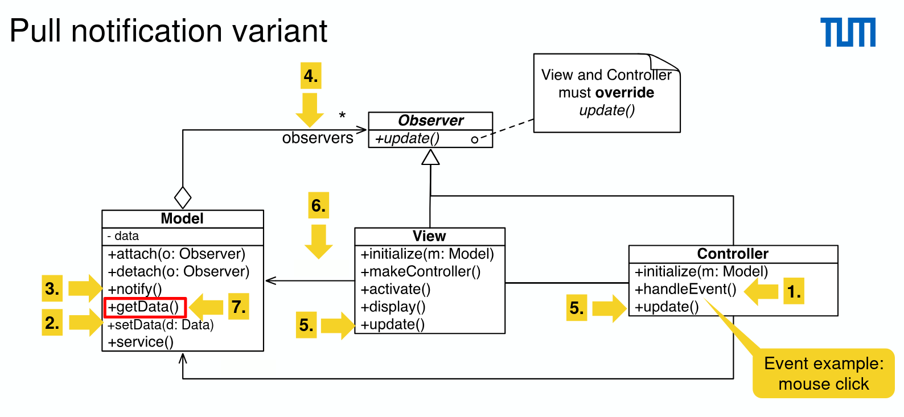

# Model View Controller

## Architectural Pattern

- Architectural patterns: system design
- Design patterns: object design
- Software archiecture:
  - components (subsystems)
  - connectors (communication)

## MVC

- Problem: in systems with high coupling any change to the boundary objects
  (user interface) often forces changes to the entity objects (data)
- Solution: decouple data access (entity objects) and data presentation
  (boundary objects)

### Model

Process and store application domain data (entity objects)

### View

Display information to the user (boundary objects)

### Controller

Interact with the user and update the model (which notifies the view)

> View and Controller together comprise the user interface. We can make Model observable and add observers to View, which are notified by the observable Model something changes. Observer typically has one method `update()` which is called by the observable.

### Modified MVC

Place controller between model and view

## Instantiation MVC

- Two choices for the notification
  - Pull notification variant: view and controller obtain the data from the model
    
    > update() has no arguments, a pure notification, need to invoke getData() to obtain the data
  - Push notification variant: the model sends the changed state to view and controller
    
    > update(d:Data) has Data as argument (payload), view and model are directly updated with the new data
- Benefits
  - Multiple synchronized views of the same model
  - Pluggable views and controllers
  - Exchangeability of look and feel
  - Framework potential
- Challenges
  - Increased complexity
  - Potential for excessive number of updates
  - Close connection between view and controller
  - Close coupling of views and controllers to model
