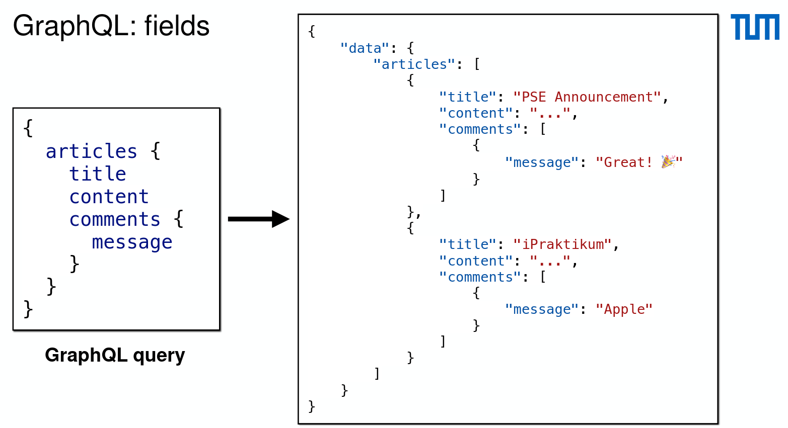
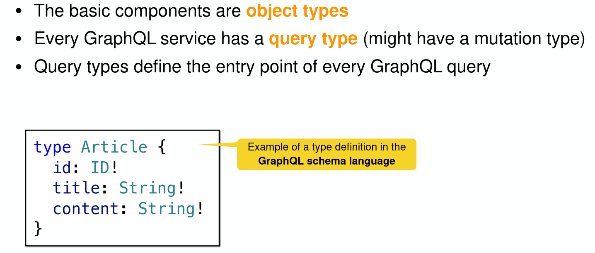

# GraphQL

- Queries can traverse related objects and their fields: more flexibility
- Subscriptions allow to push data from the web service
  to the clients that listen to real time messages
- Also uses HTTP messages and encodes queries and
  responses in the HTTP body
- At its core, GraphQL is offering the functionality to ask for specific fields on objects

