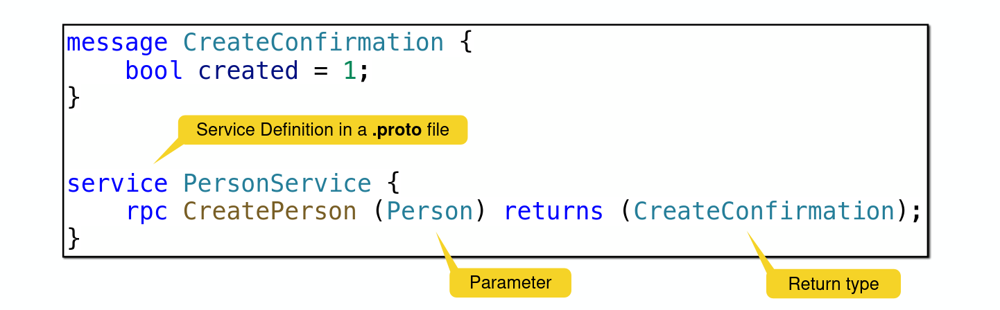

# gRPC

- RPC: Remote Procedure Calls
- Efficient connection between services across a system
  (e.g. Microservices), mobile devices, and browsers
- Default binary encoding

- gRPC IDL: protocol buffer

  - Language neutral, platform neutral, extensible way of serializing structured data
  - smaller, faster and programmatically easier than json/xml
  - defined in .proto files

  
