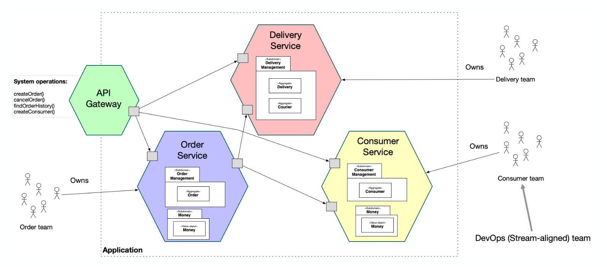
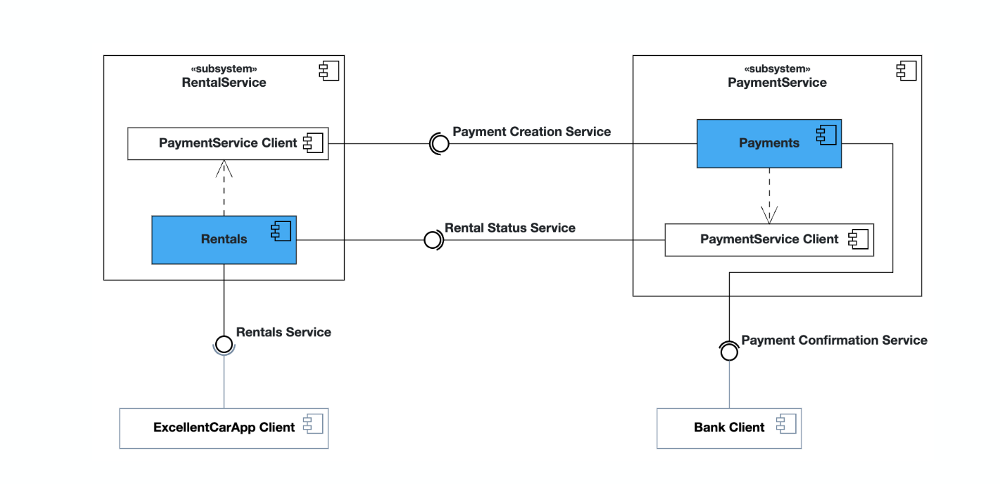

# Microservices

- An architecture that structures the application as a set of two or
  more independently deployable, loosely coupled, components, a.k.a. services
  - Single responsibility: each service focuses on a single capability
  - Independent deployment: services can be deployed without affecting others
  - Decentralized data management: each service can manage its own database
  - Lightweight communication: services communicate using APIs, often REST or gRPC
- Benefits
  - Scalibility
  - Resilience
  - Flexibility
  - Faster development
- Challenges
  - Complexity
  - Data consistency
  - Network latency
  - Deployment
  - Testing
- Key components

  - Service registry
  - API gateway
  - Inter-service communication: REST, gRPC, Apache Kafka etc.
  - Data management
  - Monitoring

  
  
