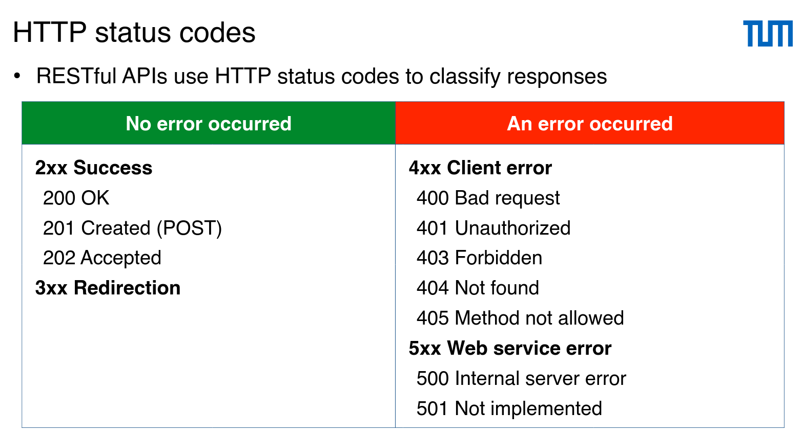

# REST (Representational State Transfer)

- Communication: layered architecture
- A protocol, often used and described with HTTP
- Use links between endpoints to navigate a web API
- Use URL endpoints to provide resources and manipulate resources
- Goal: modifiable and reusable of shared web resources and services, support scalability and availability
- Elements:
  - Web resources identified by URLs (most common URI), always a noun, never verb
    
  - RESTful web services: access to textual representations of web resources with a predefined set of operations
  - Client: invokes a RESTful web service
- Stateless request/response connector: body encoded in xml, json etc (no state info between two requests)
- Requirements
  - Client server (CS)
  - Stateless (CSS) (Each request must contain all info to understand the request, server does not keep a history of old requests)
  - Cacheable (C$SS)
  - Uniform interface (U) (between components: resources are usable across API)
  - Layered system (LS)
  - Code on demand (COD)
- CRUD (methods on resources)
  - Create: POST (Create new resource)
  - Read: GET (Retrieve existing resources) idempotent, safe
  - Update: PUT (Update an existing resource with an identifier) idempotent
  - Delete: DELETE (Delete existing resources) idempotent

## RESTful API: HTTP

- Endpoints: identified by an **URI path** and HTTP method
- Serialization:
  - Object <--> String
  - JSON: JavaScript object notation (human readable, language independent)
    

## Basic Unirest example

```java
    public void updateCar(Car car) throws UnirestException {
        /*TODO: Create an asynchronous PUT-request*/
        PutCallback putCallback = new PutCallback(car, getDelegate());
        Unirest.put(BASE_URL + "cars")
                // This defines the request format
                // For auth we can use .header("Authorization", "Bearer YOUR_ACCESS_TOKEN")
                // We can also customize the type
                .header("content-type", "application/json")
                .body(car.toJson())
                .asJsonAsync(putCallback);
    }
```

## Basic Spring REST example

```java
    @PutMapping("/{id}/confirm")
    public ResponseEntity<Payment> confirmPayment(@PathVariable String id) {
        return new ResponseEntity<>(paymentService.confirmPayment(id), HttpStatus.OK);
        // paymentService.confirmPayment(id);
    }

    public static void confirmPayment(String paymentId) throws IOException, InterruptedException {
        HttpRequest request = HttpRequest.newBuilder()
                .uri(URI.create("http://localhost:8081/payments/" + paymentId + "/confirm"))
                 // This put is handled by the method annotated with @PutMapping
                .PUT(HttpRequest.BodyPublishers.noBody())
                .build();

        HttpClient client = HttpClient.newHttpClient();
        HttpResponse<String> response = client.send(request, HttpResponse.BodyHandlers.ofString());
        if (response.statusCode() >= 200 && response.statusCode() < 300) {
            Payment payment = OBJECT_MAPPER.readValue(response.body(), Payment.class);
            System.out.println("The status of the payment with ID: " + payment.id() + ", is: " + payment.paymentStatus());
        } else {
            throw new RuntimeException("Error: " + response.statusCode() + " " + response.body());
        }
    }

```

- GET (/cars/{id}) → Fetch a specific car (ID required)
- PUT (/cars/{id}) → Update a specific car (ID required) (depends on implementation, might be /cars if a Car object is passed)
- DELETE (/cars/{id}) → Delete a specific car (ID required)
- POST (/cars) → Create a new car (No ID required, server assigns it)

## Resttemplate

```java
@RestController
public class MasterYodaController {

    // TODO 1.1 Remove endpoint responsible for training apprentices
    //  from this Controller and move it to ObiWanKenobiController
    // @GetMapping("/train-apprentices")
    // public String trainApprentices() {
    //     return "Apprentices are being trained...";
    // }

    @GetMapping("/find-apprentices")
    public String findNewApprentices() {
        return "Looking for new apprentices...";
    }

}


public String findApprentices() {
        return restTemplate.getForObject(OBI_WAN_KENOBI_SERVICE_URL + FIND_APPRENTICES_URL, String.class);
    }
```
