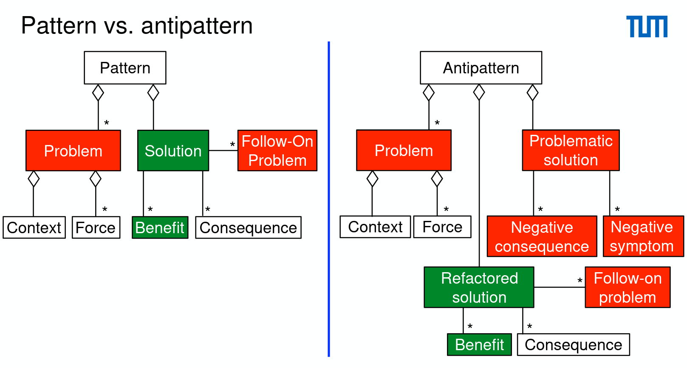
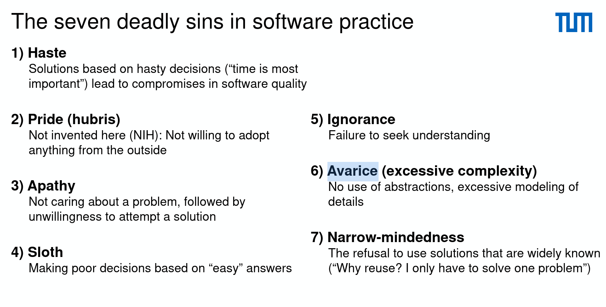
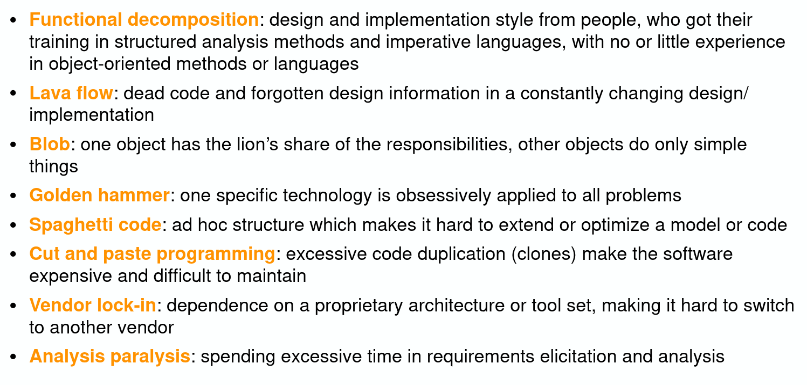

# Antipattern and Taxonomy

- Antipatterns identify and categorize common mistakes in software practice.
- "An antipattern is something that looks like a good idea, but which backfires badly when applied"

- Examples
  - Bad design
  - Too much time spent in analysis
  - Constantly missing deadlines
- Solution: Incremental Engineering (refactoring)

  

- Taxonomy
  - Development antipatterns
  - Architecture antipatterns
  - Management antipatterns

