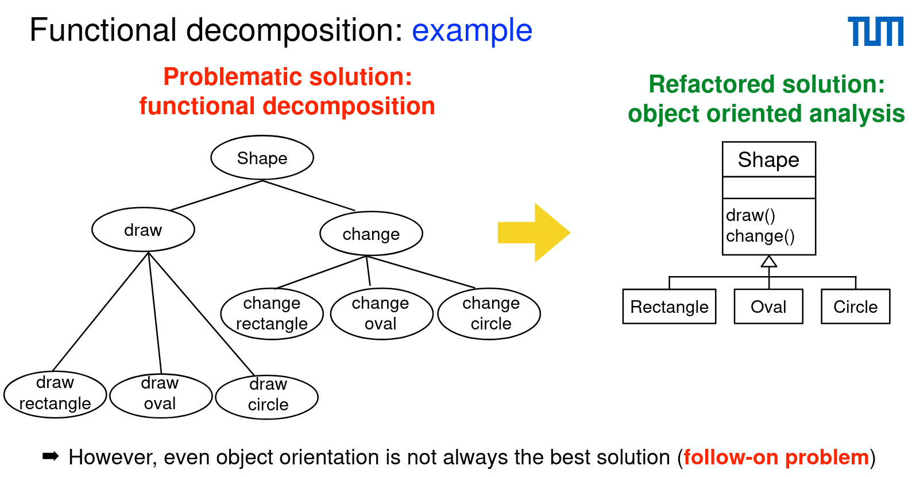

# Functional Decomposition

- Everything is a function
  - hard to understand
  - complex, impossible to maintain
- Solution: Refactoring to object oriented

Here, every concrete shape (Rectangle, Oval and Circle) will have its own `changeForm` method to change the shape as parameter to its own shape.
