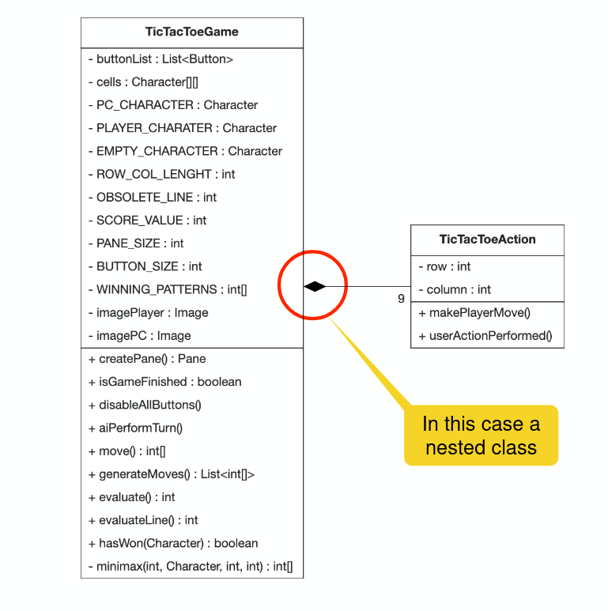
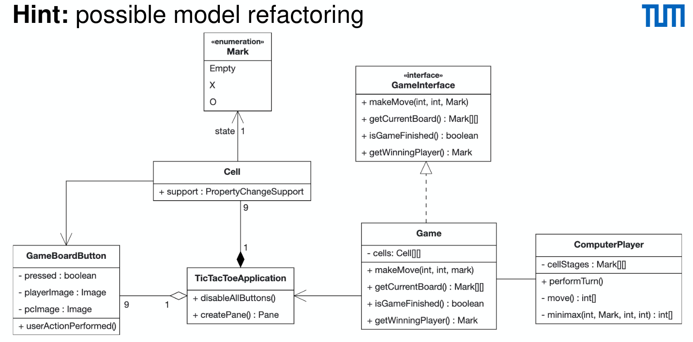

# The Blob

- God class: single controller encapsulating majority of responsibilities and functionality
- Too complex for reuse and testing
- Solution

  - Distribution of responsibilities (refactoring)
  - Remove redundant
  - indirect associations

  
  
