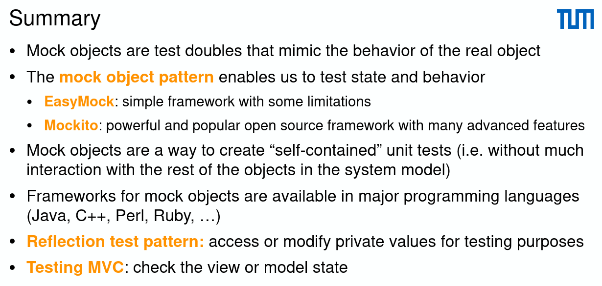

# Mock Object Pattern

- SUT: System Under Test
  
  

## EasyMock

- Uses annotations for test subjects (=SUT) and mocks

```java
@TestSubject
private ClassUnderTest classUnderTest = new ClassUnderTest();
@Mock
private Collaborator mock;
```

- Specification of the behavior

```java
expect(mock.invoke(parameter)).andReturn(42);
```

- Make the mock ready to play (always!)

```java
replay(mock);
```

- Make sure the mock has actually been called in the test (additional assertion)

```java
verify(mock)
```

- Example
  

```java
@ExtendWith(EasyMockExtension.class)
class EnrollmentServiceTest {
    @TestSubject
    private EnrollmentService enrollmentService = new EnrollmentService();
    @Mock
    private Course courseMock;
    @Test
    void testEnrollStudentSuccessful() {
        Student student = new Student();
        int expectedSize = student.getCourseList().size() + 1;
        expect(courseMock.canEnroll(student)).andReturn(true);
        replay(courseMock);
        enrollmentService.enroll(student, courseMock);
        assertEquals(expectedSize, student.getCourseList().size());
        assertTrue(student.getCourseList().contains(courseMock));
        verify(courseMock);
    }
}
```

- Correct/wrong SUT code leads to a failing test

### Mock Types

- `@Mock(MockType.NICE)`
  - Allows all method calls and returns appropriate empty values (`0`, `null`, or `false`)
- `@Mock` (default Mock)
  - Throws an `AssertionError` for unexpected method calls
  - Does not check the order of method calls
- `@Mock(MockType.STRICT)`

  - Checks the order of method calls

### Example: `canEnroll()` is actually called before `start()` in code

```java
// Wrong order
expect(courseMock.start()).andReturn(true);
expect(courseMock.canEnroll(student)).andReturn(true);
```

> Unexpected method call is e.g not implemented method called in SUT

## Mockito (A more sophiscated expanded EasyMock)

### Main features

- `mock()/@Mock`: full mocking
  - Optionally specify how it should behave via `Answer`/`MockSettings`
  - `when()`/`given()` to specify how a mock should behave
  - Stub void method: `doNothing().when(mock).voidMethod();`
  - If the provided answers don’t fit your needs, write one yourself extending the `Answer` interface
- `spy()/@Spy`: partial mocking
  - The behavior of single methods can be specified
  - Real methods are invoked but still can be verified and stubbed
- `@InjectMocks`: Objects annotated with `@Spy` or `@Mock` is injected to Objects annotated with `@InjectMocks` if it has such fields
- `verify()`: check that methods were called with given arguments
  - Can use flexible argument matching, for example any expression via the any()
  - Capture what arguments were called using `@Captor`
  - No need to specify the behavior of void methods
  - The order of the method calls is not relevant in this test, but can be verified with an inOrder verifier

### Example

```java
@ExtendWith(MockitoExtension.class)
class EnrollmentServiceTest {
    private EnrollmentService enrollmentService = new EnrollmentService();
    private Course courseMock = mock(Course.class);
    @Test
    void testEnrollStudentSuccessful() {
        Student student = new Student();
        int expectedSize = student.getCourseList().size() + 1;
        when(courseMock.canEnroll(student)).thenReturn(true);
        enrollmentService.enroll(student, courseMock);
        assertEquals(expectedSize, student.getCourseList().size());
        assertTrue(student.getCourseList().contains(courseMock));
        verify(courseMock).canEnroll(student);
    }
}
```

### Argument matchers

- Allow more flexible verification or mocking, e.g. any integer
- If you are using argument matchers, all arguments have to be provided by matchers

```java
verify(mock).someMethod(anyInt(), anyString(), eq("third argument"));
//above is correct - eq() is also an argument matcher
verify(mock).someMethod(anyInt(), anyString(), "third argument");
//above is incorrect - exception will be thrown because third argument is given without an argument matcher
when(mock).anotherMethod(anyInt(), anyString()).thenReturn(true);
//if you want all method calls to return true
```

### InjectMocks

```java
@ExtendWith(MockitoExtension.class)
class PubTest {
    // At the start of the test, a BeerDrinker object is automatically created
    // and use to create a LocalPub object using constructor injection
    @Spy
    BeerDrinker drinker;
    @InjectMocks
    LocalPub localPub;
    @Test
    void testHappyHour() {
        localPub.happyHour();
        verify(drinker).drinkBeer();
    }
}

public class LocalPub {
    private BeerDrinker beerDrinker;
    // Constructor used to inject the BeerDrinker objec automatically
    public LocalPub(BeerDrinker beerDrinker) {
        this.beerDrinker = beerDrinker;
    }
    public void happyHour() {
        beerDrinker.drinkBeer();
    }
}

public class BeerDrinker {
    public void drinkBeer() {
        System.out.println("Drink Beer");
    }
}
```

### Argument captors

- Capture argument values for further assertions

```java
@Captor
ArgumentCaptor<Person> argument;
@Test
void test() {
    // Used together with verify: what argument was used
    verify(mock).doSomething(argument.capture());
    assertEquals("John", argument.getValue().getName());
}
```
