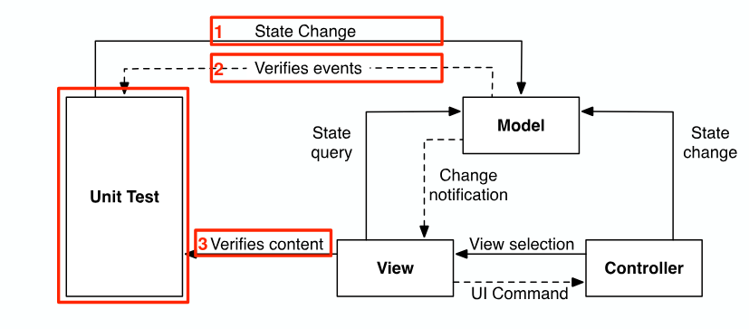
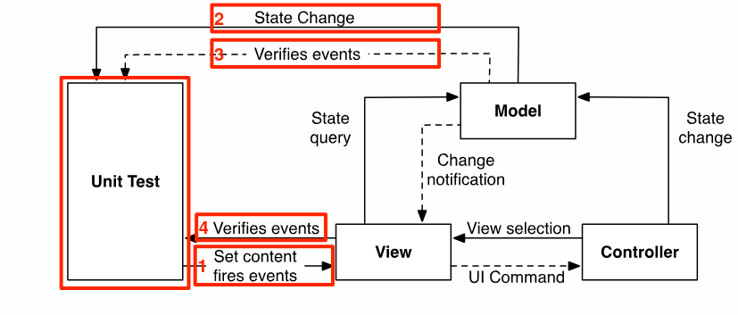

# Testing Patterns for MVC

## View state test pattern

- Tests that the view is updated correctly when the model is changed
- Controller is not tested here

## Model state test pattern

- Tests that the model is updated correctly when the user tries to update the model via the view
- May require some setup on the model itself, treats the controller as a black box
- Can check if controller is correctly updating the model
  
