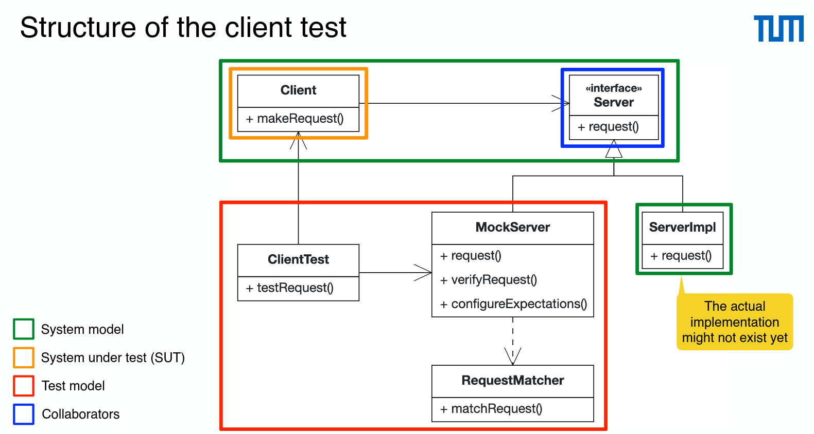
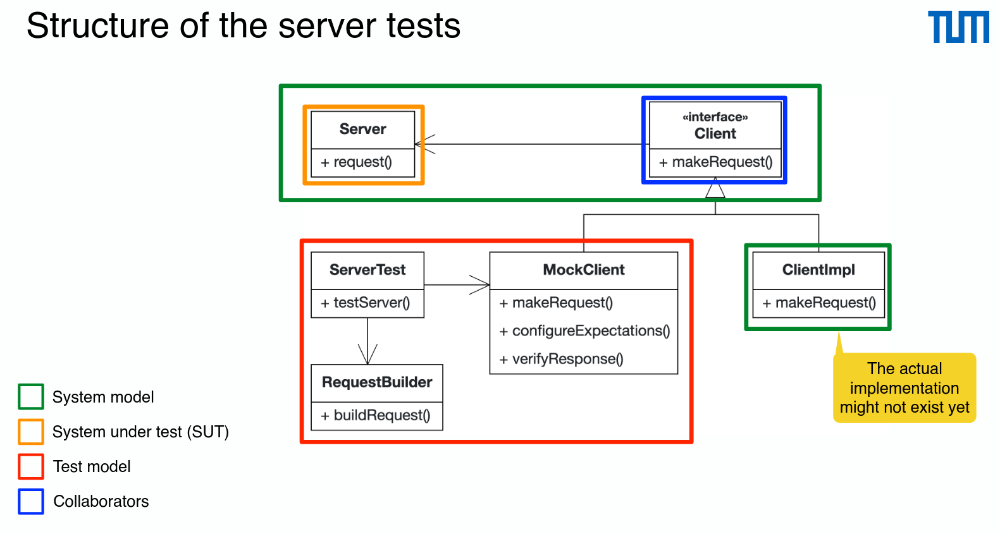

# Test Client Server Applications

- Test clients (integration) by mocking remote services
  

- Test servers (integration) by mocking client calls
  

- Example using Spring MockMvc

```java
@WebMvcTest
@ContextConfiguration(classes = RestController.class)
class RestControllerTest {
    // Allows to mock the client
    @Autowired
    private MockMvc mockMvc;
    @Autowired
    private ObjectMapper objectMapper;
    @Test
    void testGetAllObjects() throws Exception {
        List<Object> expectedResultList = new ArrayList<Object>(); // add the expected objects here
        // Performs a GET request on the actual server and checks
        // that the response code is 200 (OK)
        ResultActions request = mockMvc.perform(
                                            get("/objects"))
                                           .andDo(print())
                                           .andExpect(status().isOk());
        // Response as (json) string
        String response = request.andReturn().getResponse().getContentAsString();
        // Map response to Java objects
        List<Object> actualResultList =
        Arrays.stream(objectMapper.readValue(response, Object[].class)).collect(Collectors.toList());
        // Compare expected and actual response
        assertThat(actualResultList).containsExactlyInAnyOrderElementsOf(expectedResultList);
    }
}
```

```java
 @Test
 void testUpdateCar() throws Exception {
     Car carToUpdate = ModelStorage.getAllCars().get(0);
     ResultActions result = mockMvc.perform(
                                        put("/cars")
                                       .content(asJsonString(new Car(carToUpdate.getId(), "white", "Benz", 10000)))
                                       // telling the server the format of the request body.
                                       .contentType(MediaType.APPLICATION_JSON)
                                       // the client expects the response in JSON format.
                                       .accept(MediaType.APPLICATION_JSON))
                                       .andExpect(status().isOk())
                                       // Verifies that the JSON response has a color property with the value "white".
                                       .andExpect(MockMvcResultMatchers.jsonPath("$.color").value("white"))
                                       .andExpect(MockMvcResultMatchers.jsonPath("$.brand").value("Benz"))
                                       .andExpect(MockMvcResultMatchers.jsonPath("$.rentalCostPerDay").value("10000"));

  String returnedCarString = result.andReturn().getResponse().getContentAsString();
  Car returnedCar = objectMapper.readValue(returnedCarString, Car.class);

  assertEquals(returnedCar.getColor(), ModelStorage.getCarById(carToUpdate.getId()).getColor());
  assertEquals(returnedCar.getBrand(), ModelStorage.getCarById(carToUpdate.getId()).getBrand());
  assertEquals(returnedCar.getRentalCostPerDay(), ModelStorage.getCarById(carToUpdate.getId()).getRentalCostPerDay());
 }

```
