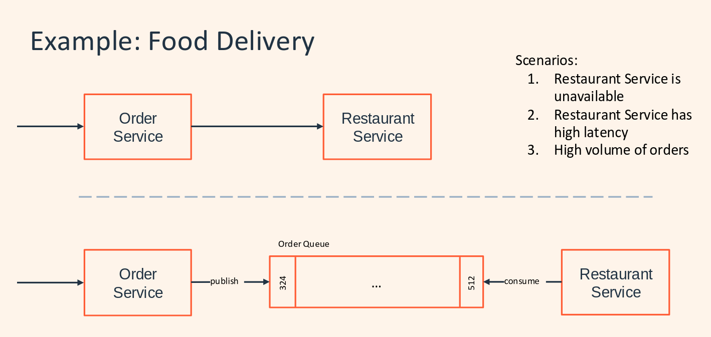
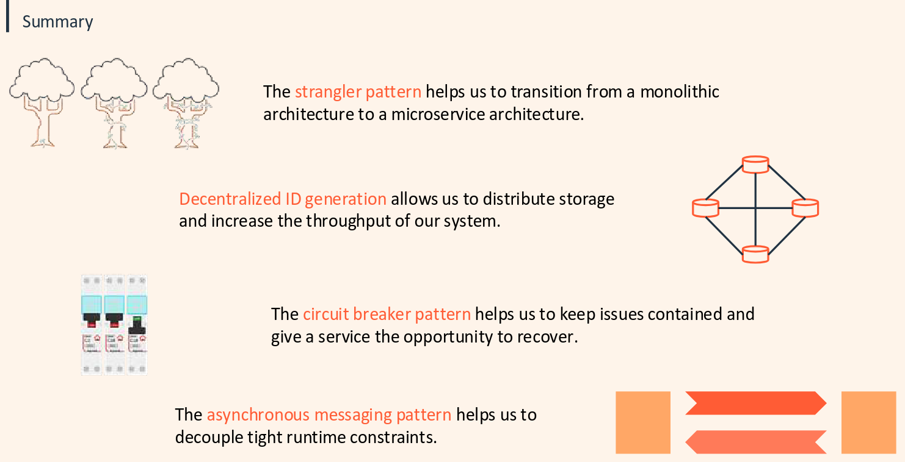

# Asynchronous Messaging

- Synchronous Messaging
  - The client waits until everything is complete
  - Peaks with high load saturate your threads
- Asynchronous communication
  - Usually achieved via message queue aka Observer Pattern
  - Can also use a database
    
    

```java
    // TODO 2.1: implement both methods using the async features of the CompletableFuture class and remove the old methods
    @PostMapping("r2")
    public CompletableFuture<String> produceR2Async(@RequestBody Droids droid) {
        CompletableFuture<String> completableFuture = new CompletableFuture<>();
        Droid producedDroid = factory.produce(droid);
        completableFuture.complete(producedDroid.getName());
        return completableFuture;
    }
```
