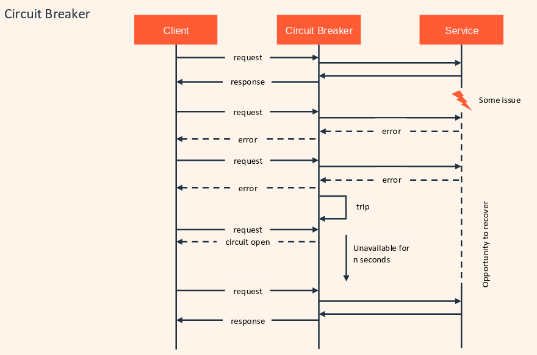
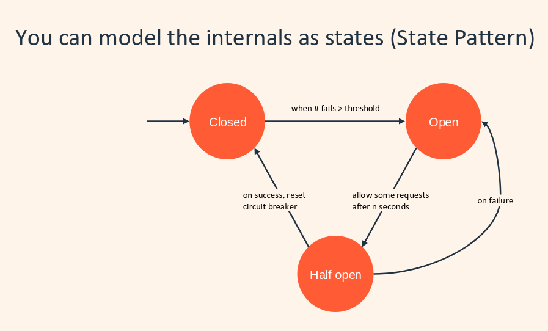

# Circuit Breaker

Prevent the system from overloading and failing by tripping the requests to a failing service for a certain period of time. After that, we retry to see if the service is back up.

