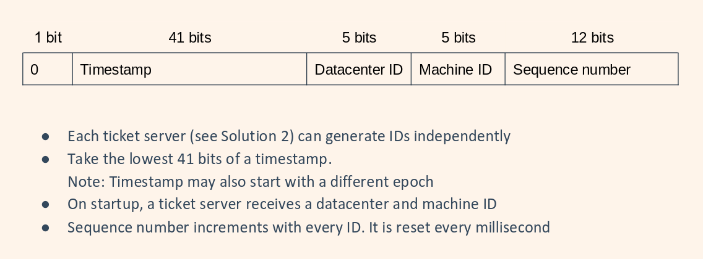

# Decentralized ID Generation

We want to have unique IDs for our DB

- UUIDs: too long, do not go up with time, could be non-numeric
- Ticket Server: single point of failure
- Twitter Snowflake
  - Pros: numric, no single point of failure, no sync
  - Cons: harder to setup, 41-bit timestamp
    
    
