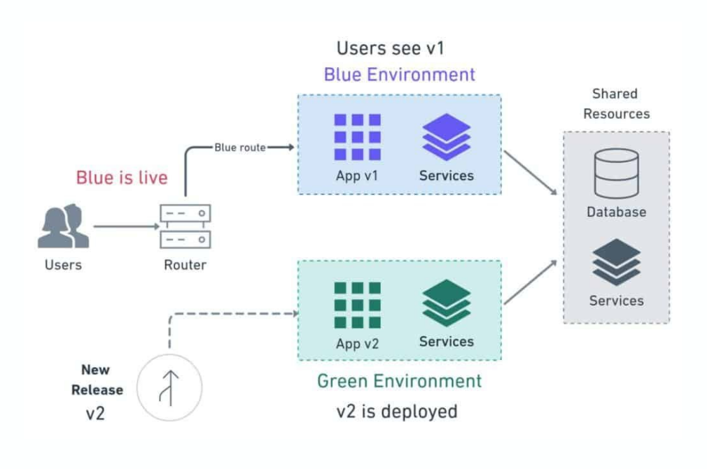

# Blue-Green Deployment

- A deployment strategy that uses two separate but identical environments,
  but high cost and effort to maintain

  - Blue: live
  - Green: idle
    > Running simultaneously, test on green, switch traffic to green when ready, rollback to blue when issues, no downtime

- nginx blue green deployment workflow

```nginx
upstream app {
    server blue-app:8080;
    # Comment out the below line to switch traffic to Blue
    # server green-app:8080;
}
server {
    listen 80;
    location / {
        proxy_pass http://app;
    }
}
```

- Use cases

  - E-Commerce
  - Banking
  - Streaming Services
  - Healthcare Systems
  - Compliance
  - SaaS providers

- Difference to A/B testing: split traffic between two versions to compare performance

- Chaos Engineering
  - Controlled experiments
  - Hypothesis-driven testing
  - Automation
  - Observability
  - Incremental testing
    
