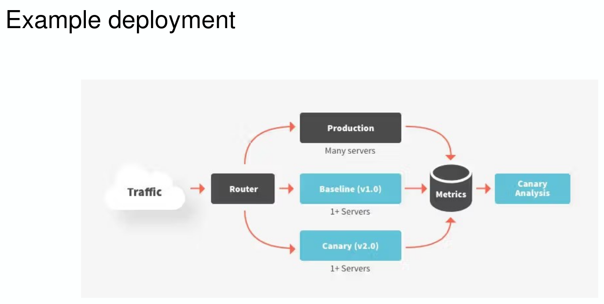
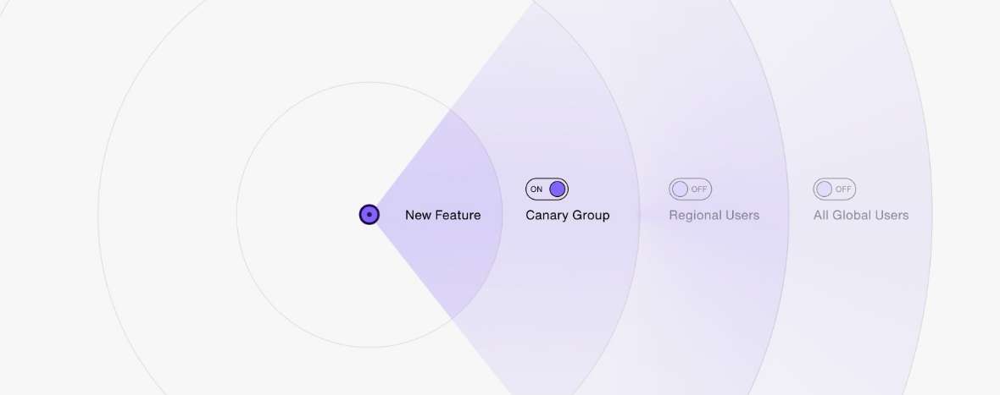

# Canary Release

A deployment strategy where changes are gradually rolled out to a
small subset of users (~5%) before full deployment: low risk, high confidence

- Key Concepts
  - Automate CI/CD pipeline
  - Use feature flags
  - Define metrics
  - Start small
  - Monitor in real-time
  - Prepare rollback

- nginx canary deployment workflow

```nginx
http {
    upstream server {
    server 192.168.1.100 weight=90; # Version 1 (90% traffic)
    server 192.168.1.101 weight=10; # Version 2 (10% traffic - Canary)
}
server {
    listen 80;
    location / {
        proxy_pass http://server;
        }
    }
}
```



