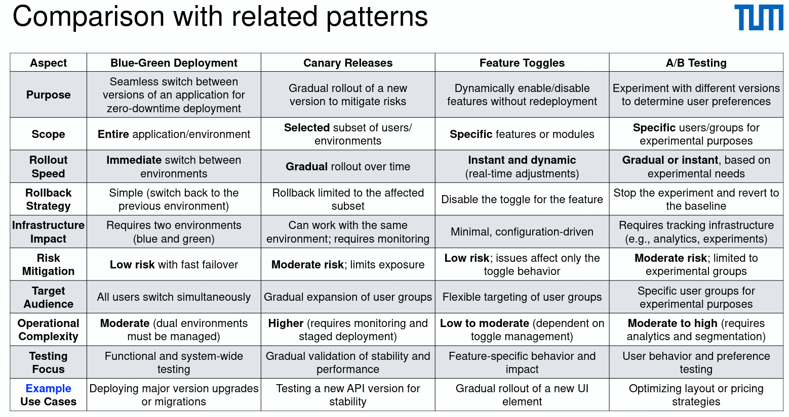

# Feature Toggles

A technique to enable or disable application features at runtime without
deploying new code

- Types

  - Release toggles: manage gradual feature rollouts to reduce risks
  - Experiment toggles: facilitate A/B testing and experimentation to optimize features
  - Ops toggles: manage operational risks by dynamically enabling or disabling features
  - Permission toggles: control feature access based on roles or permissions

- Benefits

  - Decoupled deployments
  - Controlled rollouts
  - Fast rollbacks
  - Facilitating continuous delivery

- Challenges

  - Toggle debt
  - Performance overhead
  - Increased testing complexity

- Best Practices

  - Track and remove old toggles
  - Use configuration management tools
  - Implement monitoring

- Platform: ff4j, Unleash, LaunchDarkly
- Use cases: high traffic e-commerce



- Example with FF4J

```java
public class SimpleFF4J {
    // <String featureName, boolean featureState>
    private final Map<String, Boolean> featureStore = new HashMap<>();

    public void setFeature(String featureName, boolean featureState) {
        featureStore.put(featureName, featureState);
    }

    public boolean checkFeature(String featureName) {
        return featureStore.getOrDefault(featureName, false);
    }
}

```
